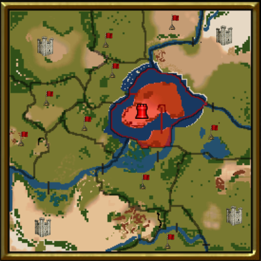

# stronghold-maps

Playable maps for Stronghold games.

## Install

To install a map, simply copy the map file into your game's maps subfolder. 

For Stronghold 2 Steam edition the default location should be *%USER%\Documents\Stronghold2\Maps* and the maps use the *.s2m* extension.

## Maps

### **Hills and Mountains**

A Kingmaker map with 5 castle Estate and 9 villages.

Spawns spot are not balanced and have variable access to resources and villages. Some existing building be used for defense.

***Parameters***:
 - *Game*: Stronghold 2
 - *Size*: Big
 - *Players*: 2 - 5
 - *Villages*: 9
 - *Balanced*: No